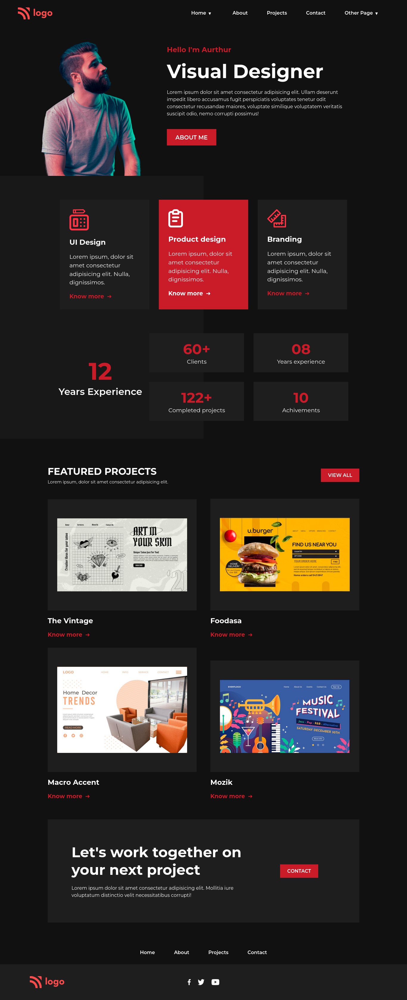

# This is Portfolio site for designer

Made by **Phani sai**

## Deployed Link

[Project Link](https://phani-sai-project-14.netlify.app/)

## Preview:

## Built with:
- HTML
- CSS with Flexbox , Grid layout

## Key learnings:

- In this project I learned to use grid and wrapper effiectively and i have used only grid.
- Creating new backgrounds using linear gradent is very new and learned very well.

## Time taken:

- This project took me 3.5 hours to build from scratch.

